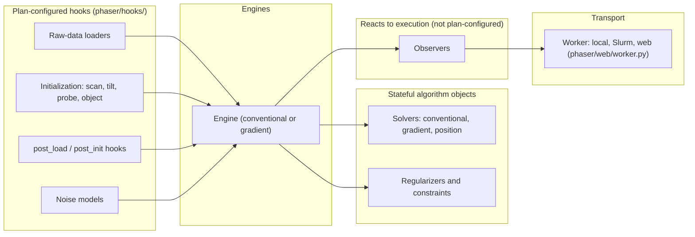

# Architecture

The architecture and extension guide, for contributors and researchers extending Phaser.
Assumes Python familiarity, not this codebase or the [cookbook](../cookbook/index.md) —
though every hook-family page here links to the cookbook recipes that use it.

## What's here

- **[Overview](overview.md)** — what Phaser reconstructs, single-slice vs. multislice and
  mixed-state probes, engines/backends, extension-mechanism table.
- **[Reconstruction lifecycle](lifecycle.md)** — parsing, raw-data loading, metadata
  merge, state init, preprocessing, engine transitions, saving/restart.
- **[State and scientific conventions](state-and-conventions.md)** — shapes, units, axis
  order, diffraction origin, intensity scaling, phase convention.
- **[Hooks](hooks/index.md)** — hook anatomy, and one page per hook family.
- **[Observers](observers.md)** — event lifecycle, built-in observers, custom ones.
- **[JAX implementation guide](jax.md)** — backend abstraction, pytrees, JIT boundaries,
  JAX-compatible custom hooks.
- **[Interfaces and deployment](interfaces.md)** — CLI, Python API, web manager, workers,
  trust model.
- **[Extension testing](testing.md)** — testing patterns, public API policy.

## Suggested reading order

1. [Overview](overview.md) — the mental model of what Phaser does.
2. [Reconstruction lifecycle](lifecycle.md) and
   [State and scientific conventions](state-and-conventions.md) together — most other
   pages assume both.
3. [Hooks](hooks/index.md) and its family pages, in the order matching what you extend.
4. [Observers](observers.md), the [JAX guide](jax.md),
   [Interfaces and deployment](interfaces.md), and [Extension testing](testing.md), in
   any order.

## Extension surfaces

Several mechanisms can look similar in YAML but behave differently. The diagram places
them relative to one reconstruction run; each is defined precisely in the
[glossary](../concepts/glossary.md).

In prose: **hooks** construct behavior from the plan (a loader, an initializer, a noise
model); **solvers**, **regularizers**, and **constraints** are stateful objects carrying
algorithm state across calls inside a running engine; **observers** react to execution
events (per-group/per-iteration updates, engine/reconstruction finish), supplied in
Python, not the plan's YAML; **worker transport** (`phaser/web/worker.py`) sends state
to and from an external process running the engine — where the
[trust model](interfaces.md) (also the authoring guide's
[trust model section](../design/authoring-guide.md#trust-model-and-warning-conventions))
becomes a deployment concern, not only a plan-authoring one.

## Maintainer sources

- `phaser/hooks/`
- `phaser/execute.py`
- `phaser/observer.py`
- `phaser/web/worker.py`
