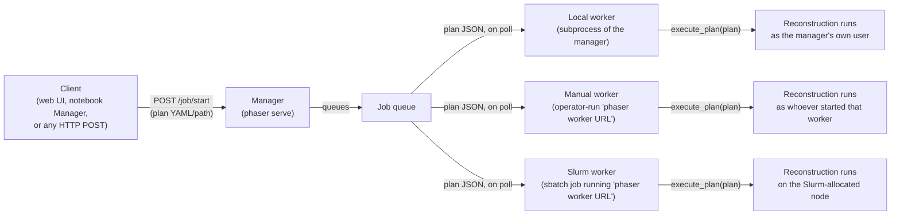

# Interfaces and deployment

This page documents every verified way to run a Phaser reconstruction — the command-line
interface, the Python API, and the web manager/worker system — and states the trust model
that applies to all of them. It assumes the [reconstruction lifecycle](lifecycle.md) and
the [hook](../concepts/glossary.md#hook)/[observer](../concepts/glossary.md#observer)
vocabulary from the [overview](overview.md).

!!! danger "Trust warning"
    Read the [Trust model](#trust-model) section before deploying any of the interfaces
    below where plans might come from someone other than the person running the process.
    A Phaser plan is code, not passive configuration.

## Command-line interface

Phaser installs one console script, `phaser`, wired to `phaser.cli:cli`
(`pyproject.toml`'s `[project.scripts]`; `phaser/cli/__init__.py`). Its subcommands are:

| Command | Defined in | What it does |
| --- | --- | --- |
| `phaser run PATH` | `phaser/cli/__init__.py:98-107` | Parses every plan document in `PATH` (`ReconsPlan.from_yaml_all`) and calls `execute_plan` on each in turn, with no extra observers. |
| `phaser serve [--host] [--port] [-v]` | `phaser/cli/__init__.py:110-128` | Starts the web manager (`phaser.web.server.server`, a Quart/Hypercorn ASGI application) — see [The web manager and workers](#the-web-manager-and-workers) below. |
| `phaser worker URL [--quiet/--loud]` | `phaser/cli/__init__.py:131-142` | Connects to a running manager at `URL` and becomes a worker process: polls for jobs and executes whichever plan the manager sends it (`phaser.web.worker.run_worker`) — see below. |
| `phaser validate [PATH] [--json/--no-json]` | `phaser/cli/validate.py`, lazily dispatched (`phaser/cli/__init__.py:152`) | Parses every plan document in `PATH` (or stdin, `-`, the default) with `ReconsPlan.from_yaml_all` and reports success or a validation error; `--json` emits a machine-readable `{result, plans}`/`{result, error}` payload instead of the plain-text message. Performs schema validation only — it does not run a reconstruction. |
| `phaser process_empad` | `phaser/cli/process_empad.py`, lazily dispatched (`phaser/cli/__init__.py:153`) | Processes EMPAD XML metadata; requires the optional `rsciio` dependency, checked before dispatch (`phaser/cli/__init__.py:31-42,145-147`). |
| `phaser calc_drift` | `phaser/cli/calc_drift.py`, lazily dispatched (`phaser/cli/__init__.py:154`) | Calculates and corrects linear scan drift from an ADF image. |

`validate`, `process_empad`, and `calc_drift` are resolved lazily by `MainCommand.get_command`
(`phaser/cli/__init__.py:81-95`), which imports `phaser.cli.<name>` and looks up a
same-named function only when that subcommand is invoked — so `process_empad`'s heavier
import graph does not load merely by running `phaser run`.

!!! note
    `phaser/main.py` defines a second, near-duplicate `cli` group (`run`, `serve`,
    `validate`, `worker`) but is not referenced anywhere in the package or
    `pyproject.toml` — the installed `phaser` command always resolves to
    `phaser.cli:cli`. This page describes only the wired-up CLI (`phaser/cli/__init__.py`);
    the duplicate in `phaser/main.py` is dead code a maintainer may want to remove or
    reconcile.

## The Python API

`phaser.execute.execute_plan` is the primary entry point for running a plan from Python:

```python
def execute_plan(
    plan: ReconsPlan, *, xp: t.Any = None, seed: t.Any = None,
    name: t.Optional[str] = None,
    init_state: t.Union[ReconsState, PartialReconsState, None] = None,
    observers: t.Union[Observer, t.Iterable[Observer], None] = None,
    override_observers: t.Union[Observer, t.Iterable[Observer], None] = None,
):
```

(`phaser/execute.py:21-27`.) `plan` is a validated `ReconsPlan` (for example from
`ReconsPlan.from_yaml`); `xp` and `seed` override the plan's backend selection and random
seed; `name` overrides the plan's `name` field for this run; `init_state` supplies a
restart state directly instead of (or as well as) `plan.init.state`. `observers=` appends
one or more `Observer` instances after the built-in `SaveObserver`/`LoggingObserver`
defaults; `override_observers=` replaces the observer set entirely — passing both raises
`TypeError`; see [Observer construction](lifecycle.md#observer-construction) for the full
rule, and [Observers](observers.md) for the `Observer` interface itself. `execute_plan`
calls `initialize_reconstruction` (same module) to build the initial `PreparedRecons` and
then runs each engine in turn; `initialize_reconstruction` can also be called directly for
the prepared state without running any engine.

`phaser.web.notebook.Manager` (`phaser/web/notebook.py`) is a third, Jupyter-oriented way
to reach the same execution path without a shell: it launches the web manager
(`phaser.web.server.server`) in a subprocess, displays its dashboard in an `ipywidgets`
`Accordion`/`iframe`, and its `start_job(plan)` method serializes a `ReconsPlan` to YAML
and `POST`s it to the manager's `/job/start` endpoint — the same endpoint the CLI worker
flow uses. It is a Python-side convenience over the web manager, not a separate execution
path.

## The web manager and workers

`phaser serve` starts a Quart application (`phaser.web.server.server`, ASGI-served via
Hypercorn) that acts as a **manager**: it accepts plans, queues them as **jobs**, and
dispatches queued jobs to connected **workers**, which are separate processes that
actually call `execute_plan`. The manager itself never executes reconstruction code — only
workers do.



In prose: any client that can reach the manager's HTTP API submits a plan; the manager
validates and queues it as a job; whichever worker next polls the manager receives that
job's plan (as a JSON string) and runs it. The sections below describe each part.

### Jobs

`POST /job/start` (`phaser/web/routes.py:77-99`) accepts `{"source": "path", "path": ...}`
or `{"source": "yaml", "data": ...}`. Either way, `Job.from_path`/`Job.from_yaml`
(`phaser/web/server.py:287-323`) validates the input by running
`python -m phaser validate --json` in a subprocess and parsing its JSON result, then
constructs one `Job` per plan document and adds it to `server.jobs` and the FIFO
`server.job_queue` (`phaser/web/server.py:387-445`). A `Job` tracks status (`queued`,
`starting`, `running`, `stopping`, `stopped`), caches the latest reported state, and
records log messages forwarded from its worker; `/job/<id>`, `/job/<id>/cancel`,
`/job/<id>/delete`, and `/job/<id>/logs` (`phaser/web/routes.py`) expose this over HTTP,
and `/job/<id>/listen` is a WebSocket stream of the same updates.

### Workers

A `Worker` (`phaser/web/server.py:60-156`, abstract base class) tracks connection status
(`queued`, `starting`, `idle`, `running`, `stopping`, `stopped`, `unknown`) and answers
`WorkerMessage`s posted to `/worker/<id>/update` (`phaser/web/routes.py:220-228`): on
`connect` it records the worker's hostname and available backends; on `poll` (or after a
finished `job_result`), if the job queue is non-empty, it pops the next job and returns a
`JobResponse` containing that job's plan (serialized JSON) — otherwise it replies `ok`
with no job. Three worker types are implemented (`POST /worker/<type>/start`,
`phaser/web/routes.py:46-75`):

- **`local`** (`LocalWorker`, `phaser/web/server.py:158-194`) — the manager itself spawns
  `phaser.web.worker.run_worker` in a `multiprocessing.Process` on the same machine,
  targeting the manager's own worker-update URL, and restarts it automatically on a
  `SIGHUP` exit code.
- **`manual`** (`ManualWorker`, `phaser/web/server.py:196-204`) — the manager does not
  start a process at all; it logs the command an operator must run themselves
  (`Worker command: python -m phaser worker <url>`, matching the CLI `phaser worker`
  command above) and waits for that external process to connect.
- **`slurm`** (`SlurmWorker`/`SlurmManager`, `phaser/web/slurm.py`) — the manager checks
  `sbatch --version` is available, then runs `sbatch --job-name=... <args>
  slurm_worker.sh <url>` (`phaser/web/slurm.py:72-105`), where `slurm_worker.sh`
  (`phaser/web/slurm_worker.sh`) is a bundled shell script that, once the scheduler starts
  it, loads a specific module/conda environment and repeatedly runs
  `python -m phaser worker <url>` (restarting on `SIGHUP`, same as the local worker). The
  manager then polls `squeue --json` on an interval to track that Slurm job's state
  (`phaser/web/slurm.py:117-165`).

!!! warning "Restriction"
    The bundled `slurm_worker.sh` and the `sbatch` argument string in
    `phaser/web/slurm.py:79` (`--partition=xeon-g6-volta --gres=gpu:volta:1`, a
    `module load anaconda/...` line, and a hardcoded CUDA module path) are specific to one
    cluster's environment, not a portable template — a site deploying the Slurm worker
    needs to adapt both the script and these arguments to its own scheduler
    configuration. `/worker/slurm/start` (`phaser/web/routes.py:59-68`) also only accepts
    the request on `linux`/`darwin` and hardcodes a replacement IP address in the
    callback URL (`.replace('localhost', '172.22.254.14')`) — another site-specific value
    a deployer must change.

Whichever worker type is used, the actual reconstruction is run by
`phaser.web.worker.run_worker` (`phaser/web/worker.py:88-206`), the same function `phaser
worker URL` invokes from the CLI: it sends a `ConnectMessage` (hostname, available
backends via `phaser.utils.num.get_devices`), loops polling for jobs (`backoff`-wrapped
HTTP retries), and for each job received parses its plan with `ReconsPlan.from_jsons` and
calls `execute_plan(plan, observers=WorkerObserver(...))` (`phaser/web/worker.py:161-162`).
`WorkerObserver` (`phaser/web/worker.py:43-85`) reports state back to the manager over the
same HTTP connection instead of writing to disk locally — full state on engine init,
per-group updates throttled to at most once per 30 seconds unless forced, and every
iteration update sent unconditionally; a `LogHandler` (lines 26-40) similarly forwards
Python log records to the manager. If the manager signals `shutdown`/`reload`/`cancel` in
response to any of these messages, `SignalException` interrupts the running job.

## Trust model

!!! danger "Trust warning"
    A Phaser plan is not passive configuration — running one is equivalent to running an
    untrusted script, because two documented mechanisms in the plan schema execute
    arbitrary Python:

    - **Expression schedules** (`ScheduleHook`'s `expr` type, `phaser/hooks/schedule.py:58-72`)
      evaluate a plan-supplied string with Python's `eval`, passing `i`, `iter`, `state`,
      `niter`, and `np` as the only named globals — but the `globals` dictionary passed to
      `eval` does not set `__builtins__: {}`, so Python auto-injects the real builtins,
      leaving `__import__`, `open`, `exec`, and everything else reachable from arbitrary
      Python. This is not a scoped, sandboxed mini-language; it is unrestricted `eval`.
    - **External hooks** (any `"package.module:function"` reference accepted anywhere a
      `Hook` is expected, `phaser/hooks/hook.py`) import and call arbitrary importable
      code with plan-supplied properties, which are not schema-validated for external
      hooks.

    **Anyone who can submit a plan to a process that will execute it — a local `phaser
    run`/`phaser validate` invocation, or a job submitted to a manager's `/job/start`
    endpoint that a worker later polls and runs — can execute arbitrary code as that
    process.** For the CLI, this is the same trust boundary as running any other script
    you did not write, and is usually obvious. For the web manager and its workers, it is
    easy to overlook: the manager's HTTP API has no authentication in the code read for
    this page, so **whoever can reach `/job/start` can run arbitrary code as every worker
    that later polls the queue** — a local worker (the manager's own machine and user), a
    manual worker (whoever's account is running `phaser worker`), or a Slurm worker
    (arbitrary code on a shared cluster node, under whichever account submitted the Slurm
    job). Only run the manager and its workers where every plan submitter is already
    trusted to run code as that worker; do not expose `/job/start` to an untrusted
    network without your own authentication and sandboxing, which Phaser does not
    provide.

This applies identically regardless of interface — CLI, Python API, or web manager —
because all of them eventually call the same `execute_plan`, which resolves and calls
whatever hooks and schedules the plan names. See the
[schedules and flags](../cookbook/parameters/schedules-and-flags.md) parameter page for
the same warning in the context Track A readers encounter it, and the
[glossary's plan entry](../concepts/glossary.md#plan) for the one-sentence version.

## Maintainer sources

- `phaser/cli/__init__.py`
- `phaser/cli/validate.py`
- `phaser/execute.py`
- `phaser/hooks/schedule.py`
- `phaser/hooks/hook.py`
- `phaser/web/server.py`
- `phaser/web/worker.py`
- `phaser/web/routes.py`
- `phaser/web/slurm.py`
- `phaser/web/slurm_worker.sh`
- `phaser/web/notebook.py`
- `pyproject.toml`
