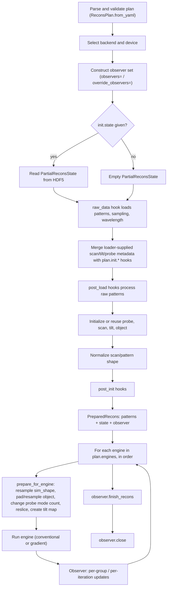

# Reconstruction lifecycle

This page follows one reconstruction from a plan file to saved output, verified against
`phaser/execute.py`. It assumes the [overview](overview.md)'s vocabulary (engine, hook,
backend) and is itself assumed by every [hook-family page](hooks/index.md).

## Lifecycle diagram

The diagram follows `initialize_reconstruction`, `execute_plan`, `execute_engine`, and
`prepare_for_engine`, all in `phaser/execute.py`. The sections below expand every step in
prose, in execution order.

## Parse and validate

`ReconsPlan.from_yaml` (or `.from_data`/`.from_json`) parses a plan file using `pane` into
a `ReconsPlan` (`phaser/plan.py`). Validation happens here: unknown fields, wrong types,
and unregistered built-in hook names are rejected before any data is loaded or any array
is allocated. A validated `ReconsPlan` is what every later step consumes.

## Backend and device selection

`initialize_reconstruction` (`phaser/execute.py`) resolves the array-computation
[backend](../concepts/glossary.md#backend) and device before anything else runs:

- if the Python API caller passes `xp=`, that backend is used, and its first available
  device unless a `device=` argument overrides it;
- otherwise, the plan's top-level `backend` field selects a backend (`get_backend_module`),
  falling back to `get_default_backend()` (`phaser/utils/num.py`) if the plan does not set
  one — which prefers a GPU-backed JAX or Torch installation, then falls back through
  JAX, Torch, CuPy, to NumPy;
- the chosen device is set as the process default (`set_default_device`) before any state
  is constructed.

## Observer construction

`_normalize_observers` (`phaser/execute.py:97-125`) builds the `ObserverSet` used for the
whole reconstruction:

- **`observers=`** appends the caller's observer(s) after two built-in defaults,
  `SaveObserver()` and `LoggingObserver()` — so passing `observers=` always keeps saving
  and logging active.
- **`override_observers=`** replaces the observer set entirely with only what is passed —
  the built-in `SaveObserver`/`LoggingObserver` defaults are not included. Passing both
  `observers=` and `override_observers=` together raises `TypeError`.

Neither argument is part of the plan's YAML schema; both are Python-only arguments to
`execute_plan`/`initialize_reconstruction`. See [Observers](observers.md) for the full
event lifecycle and built-in observer behavior.

## Raw-data loading and the initialization merge

`load_raw_data` (`phaser/execute.py:162-224`) calls the plan's `raw_data` hook once, with
no arguments, to get a `RawData` dictionary: `patterns`, `mask`, `sampling`, and,
optionally, `wavelength` and metadata-derived `scan_hook`/`tilt_hook`/`probe_hook` values
(a loader may supply none, some, or all of these — the EMPAD, Gatan, and Nion loaders
supply scan metadata, for example, while a fully manual loader may supply none).

### Initialization is a merge, not a replacement

Before scan, tilt, or probe are constructed, each loader-supplied metadata hook is
combined with the plan's corresponding `init.*` field by `merge()`
(`phaser/execute.py:458-482`), called separately for `scan_hook`, `tilt_hook`, and
`probe_hook` (`phaser/execute.py:181-192`):

- **If `init.X` is unset (`None`)**, the loader-supplied metadata hook, if any, is used
  as-is — nothing from the plan overrides it.
- **If `init.X` names the same hook type as the loader-supplied metadata** (matching
  `ref`), the two are merged recursively, field by field: a field the plan sets overrides
  the loader's value for that field; a field only the loader sets is retained. Verified by
  `tests/test_initialization.py:60` (`test_load_raw_data_override`): a loader-supplied
  `raster` scan hook with `shape=(32, 32)` merged with a plan `init.scan` of
  `{type: raster, step_size: (1.0, 1.0)}` produces `shape=(32, 32)` (kept from the loader)
  **and** `step_size=(1.0, 1.0)` (overridden by the plan) in one merged hook.
- **If `init.X` names a different hook type**, the plan's hook replaces the loader's
  metadata hook entirely — no field-level merging happens. The same test changes
  `init.scan` to an external reference (`custom.package:raster2`, a different `ref` than
  the loader's `raster`) and the merged result becomes exactly `{type:
  custom.package:raster2}`, discarding the loader's `shape`/`step_size` entirely.

Once `load_raw_data` returns, `initialize_reconstruction` decides, for scan, probe, tilt,
and object independently, whether to **reuse** the corresponding component from a
restart's `init_state` or **construct it fresh** from the merged hook:

- **the prior state's component is reused** only if `init_state.X is not None` (a value
  was loaded from `init.state`'s HDF5 file or passed as `init_state=`) **and** `plan.init.X
  is None` (the plan does not configure that component at all) — see
  `phaser/execute.py:288-345` for probe, scan, tilt, and object in turn.
- **an empty mapping `plan.init.X = {}` still counts as `plan.init.X` being set** — it is
  not `None` — so it is *not* reused from a prior state even on restart. Verified by
  `tests/test_initialization.py:125` (`test_load_raw_data_prev_state`): with `init:
  {scan: {}}` and a restart state that supplies a scan array, the reconstructed scan is
  **not** equal to the restart scan (`assert ~numpy.all(numpy.isclose(recons.state.scan,
  scan_state))`) — it is instead rebuilt from the loader's scan metadata. In effect, `{}`
  requests metadata-derived initialization for that component instead of carrying over
  what a restart file provided, while leaving the metadata itself unmodified.

The [Initialization](hooks/initialization.md) hook-family page documents the `scan`,
`tilt`, `probe`, and `object` hooks themselves; this page documents only the merge and
reuse rule that decides which configuration reaches them.

### post_load

Once the merged metadata is resolved, `plan.post_load` hooks run in order, each receiving
and returning the whole `RawData` dictionary (`phaser/execute.py:216-218`) — this is where
cropping, offsetting, scaling, binning, or synthetic Poisson noise are applied to the raw
patterns before any reconstruction state exists.

## State initialization

With `post_load` complete, `initialize_reconstruction` builds each state component:

1. **Probe** — reused from `init_state.probe` (resampled to the loader's sampling if it
   differs) if eligible per the merge rule above; otherwise built by calling the merged
   `ProbeHook`.
2. **Scan** — reused from `init_state.scan` if eligible; otherwise built by calling the
   merged `ScanHook`.
3. **Tilt** — reused from `init_state.tilt` if eligible; otherwise, if a tilt metadata
   hook is present (merged or loader-supplied), built by calling it; otherwise left `None`.
4. **Object** — reused from `init_state.object` if eligible; otherwise built by calling
   `plan.init.object` (defaulting to the `random` object hook) with an `ObjectSampling`
   derived from the scan extent and the first engine's `obj_pad_px`.

The four components are assembled into a `ReconsState` (`phaser/state.py`), and then
`state = state.to_xp(xp)` (`phaser/execute.py:355`) converts every array in the state to
the selected backend. This conversion is necessary because state components can come from
different places with different backends — freshly built by a hook (which receives `xp`
directly), or reused from a restart file or externally-supplied `init_state` (typically
NumPy arrays read from HDF5) — so one explicit conversion normalizes all of them before
the reconstruction proceeds. The source carries an open comment at this line
(`# TODO: figure out why this isn't already the case`); this page describes the
conversion that actually happens and does not speculate about that comment's resolution.

After conversion, `_normalize_scan_shape` (`phaser/execute.py:128-159`) reshapes
`state.scan`, `patterns.patterns`, and, if present, `state.tilt` to a common leading shape
(choosing whichever of the scan or pattern shape has more dimensions), so the two arrays
agree on scan-position count.

### post_init

`plan.post_init` hooks then run in order, each receiving and returning `(data, state)`
(`phaser/execute.py:358-363`) — this is where invalid patterns can be dropped or the
diffraction-pattern origin can be aligned, now that a complete state exists.

Finally, `initialize_reconstruction` checks the mean total pattern intensity and logs a
warning if it is below 5.0 (`phaser/execute.py:367-374`), since a very low value usually
indicates the patterns are not scaled to physical particle counts — see
[Intensity and count scaling](state-and-conventions.md#intensity-and-count-scaling). The
result, a `PreparedRecons` (patterns, state, name, observer set), is what every engine
receives.

## Sequential engines

`execute_plan` (`phaser/execute.py:21-47`) sets the total iteration count
(`sum` of every engine's `niter`) and then calls `execute_engine` once per entry in
`plan.engines`, in order, threading the same `PreparedRecons` through each call.

### Engine-boundary reshaping

Before an engine's solver runs, `prepare_for_engine` (`phaser/execute.py:384-452`) may
reshape the shared state to match that engine's configuration. In the order the code
performs them:

1. **Backend check** — if the engine is a `GradientEnginePlan` and the active backend is
   neither JAX nor Torch, this raises `ValueError` immediately (see
   [Engine families and backends](overview.md#engine-families-and-backends)).
2. **Resample probe and patterns to `sim_shape`** — if the engine sets `sim_shape` and it
   differs from the probe's current shape, the probe and the patterns (and pattern mask)
   are resampled to it, using either `pad_crop` (fixed physical extent) or `resample`
   (fixed pixel size) depending on `resize_method`.
3. **Resample the object to the probe's pixel size** — if the object's sampling and the
   (possibly just-resampled) probe's sampling disagree, the object is resampled to match.
4. **Pad the object to the engine's field of view** — the object is expanded (never
   shrunk) to cover the scan extent plus `obj_pad_px` at the probe's pixel size, if that
   is larger than the object's current extent.
5. **Change probe mode count** — if the engine's `probe_modes` differs from the probe's
   current mode count: reducing truncates to the first `engine.probe_modes` modes;
   increasing sums the existing modes in real space and recreates that many modes via
   `make_hermetian_modes`, weighting the base mode by `base_mode_power`.
6. **Reslice the object** — if the engine sets `slices` and its thicknesses differ from
   the object's current thicknesses (in count or in value), the object is resliced via
   `resample_slices` to the engine's slice thicknesses.
7. **Create a tilt map** — if the engine is a `GradientEnginePlan` and any of its solvers
   target the `tilt` variable, and `state.tilt` is currently `None`, a zeroed tilt array
   matching the scan shape is created.

This is what makes staged workflows possible — for example, a coarse conventional engine
followed by a gradient-descent engine at higher resolution, more probe modes, more object
slices, or with tilt refinement newly enabled — without the plan author reconstructing
those arrays by hand between stages.

After `prepare_for_engine`, `execute_engine` (`phaser/execute.py:50-94`) resets
`state.iter` for the new engine (`engine_num` incremented, `engine_iter` reset to `0`,
`n_engine_iters` set to that engine's `niter`), wraps the observer set in a
`PatienceObserver` if `early_termination` is configured, and calls the engine hook itself
with a fixed `EngineArgs` payload (`data`, `state`, `dtype`, `xp`, `recons_name`,
`observer`, `seed`). The engine hook resolves to
`phaser.engines.conventional.run:run_engine` or `phaser.engines.gradient.run:run_engine`
(`EngineHook.known`, `phaser/plan.py`) and returns an updated `ReconsState`.

An `EarlyTermination` exception raised during an engine's run replaces `recons.state` with
the state captured at termination; if the exception says not to continue
(`continue_next_engine=False`), the whole reconstruction finishes early rather than
proceeding to the next engine in the list.

### Observers during a run

Within an engine's run, observers see every group and iteration, not just engine
boundaries — `update_group` and `update_iteration` are called far more often than the
engine-level `init_engine`/`start_engine`/`finish_engine` calls. See
[Observers](observers.md) for the full event list.

## Saving and finishing

After every engine in `plan.engines` has run (or the reconstruction terminated early),
`execute_plan` calls `observer.finish_recons(recons.state)` and, in a `finally` block,
`observer.close(...)` with any exception info — so observers always get a chance to flush
or clean up, whether the reconstruction succeeded or raised. The built-in `SaveObserver`
(part of the default observer set unless `override_observers=` was used) writes state and
images to disk over the course of a run; see [Observers](observers.md) for save cadence
and file layout, and
[State and scientific conventions](state-and-conventions.md#serialization) for the HDF5
format itself.

## Maintainer sources

- `phaser/execute.py`
- `phaser/plan.py`
- `phaser/state.py`
- `phaser/observer.py`
- `tests/test_initialization.py`
