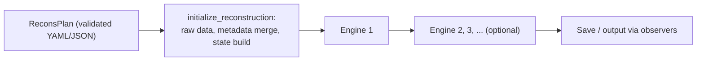

# Architecture overview

Phaser is a typed **reconstruction-plan** executor: a YAML or JSON file is validated into
a `ReconsPlan` (`phaser/plan.py`), one raw-data hook loads a 4D-STEM dataset, that
metadata is merged with any explicit initialization the plan supplies, a
[`ReconsState`](state-and-conventions.md) is built, one or more **engines** run in
sequence against that shared state, and **observers** react throughout. This page is the
mental model every other architecture page assumes: what Phaser reconstructs, which
engines and backends run it, and how the extension surfaces differ.

## What Phaser reconstructs

Phaser reconstructs the specimen's complex transmission function (the
[**object**](../concepts/glossary.md#object)) and the illuminating wavefunction (the
[**probe**](../concepts/glossary.md#probe)) from a series of overlapping-position
diffraction measurements — see
[Ptychography in Phaser](../concepts/ptychography.md) for the underlying scientific
problem. Two representation choices shape every other page in this guide:

- **Single-slice versus multislice.** `ObjectState.data` (`phaser/state.py`) always has a
  leading slice axis, shape `(z, y, x)`; `ObjectState.thicknesses` gives each slice's
  physical thickness. A single-slice object has fewer than two thicknesses. A
  **multislice** ([glossary](../concepts/glossary.md#slice-multislice)) object divides
  the specimen along the beam direction into several thin transmission functions
  connected by free-space propagation, representing thickness effects a single slice
  cannot. The plan-level `slices` field controls slice count and thickness; changing it
  between engines triggers reslicing — see
  [Engine-boundary reshaping](lifecycle.md#engine-boundary-reshaping).
- **Mixed-state probes.** `ProbeState.data` (`phaser/state.py`) has shape `(modes, y, x)`.
  When `probe_modes > 1`, the probe is an incoherent sum of orthogonal modes — a
  [**mixed state**](../concepts/glossary.md#mixed-state) — each carrying a fraction of
  the total probe intensity set by `base_mode_power` (`phaser/plan.py`), modeling partial
  spatial coherence a single coherent mode cannot capture.

## Engine families and backends

A plan's `engines` field is an ordered list of [**engine**](../concepts/glossary.md#engine)
hooks; `phaser.execute.execute_plan` runs them one after another against one shared
`ReconsState`. Two engine families are registered (`EngineHook.known`, `phaser/plan.py`):

| Engine family | Plan type | Registered solvers | Backend restriction |
| --- | --- | --- | --- |
| **Conventional** | `ConventionalEnginePlan` | `epie`, `lsqml` (`ConventionalSolverHook.known`, `phaser/plan.py`) | None enforced by `prepare_for_engine` |
| **Gradient descent** | `GradientEnginePlan` | `sgd`, `adam`, `polyak_sgd` (`GradientSolverHook.known`, `phaser/plan.py`) | Requires the `jax` or `torch` backend |

!!! warning "Restriction"
    The gradient descent engine requires the `jax` or `torch` backend. `prepare_for_engine`
    (`phaser/execute.py:386-387`) raises `ValueError("The gradient descent engine requires
    the 'jax' or 'torch' backend.")` for any other backend — accepting **either** JAX or
    Torch, not JAX-only, despite older project documentation. The conventional engines
    (ePIE, LSQML) are not backend-restricted in this code path.

The gradient engine's solvers are declared per [`ReconsVar`](../concepts/glossary.md)
(`object`, `probe`, `positions`, `tilt`) rather than once for the whole engine: a solver
handling only `object`/`probe` runs once per **group**, one handling only
`positions`/`tilt` runs once per **iteration**, and a plan is rejected if a single solver's
variable set mixes group and iteration variables
(`phaser/engines/gradient/run.py:31-56`, `process_solvers`, raising `ValueError` on
overlap). This is also how tilt refinement is optimized: a gradient solver can target
`tilt`, and `prepare_for_engine` creates a zeroed tilt map the first time it does
(`phaser/execute.py:446-450`).

!!! warning "Restriction"
    Tilt refinement (`init.tilt`, a gradient solver targeting `tilt`) is a **gradient-engine
    optimization**. Conventional engines forward-apply a fixed tilt through
    `tilt_propagators` (`phaser/engines/conventional/solvers.py`) but have no per-iteration
    tilt-update path — `phaser/engines/conventional/run.py` never reads `update_tilt`, so
    that `EnginePlan` flag is inert for `ConventionalEnginePlan` even though it is inherited
    from the shared `EnginePlan` base class.

A **backend** ([glossary](../concepts/glossary.md#backend)) is the array-computation
library a reconstruction runs on: `numpy`, `cupy`, `jax`, or `torch`
(`BackendName`, `phaser/types.py`). The plan's top-level `backend` field selects one
explicitly, or `xp=` to the Python API; without either, `get_default_backend`
(`phaser/utils/num.py`) prefers a GPU-backed JAX or Torch installation, then falls back
through JAX, Torch, CuPy, to NumPy. Noise models are also engine-restricted despite
sharing one schema field per engine — see
[State and scientific conventions](state-and-conventions.md#intensity-and-count-scaling)
for the Poisson-noise-model restriction.

## Execution diagram

In prose: a plan is parsed and validated, a single `initialize_reconstruction` call loads
raw data and builds the initial `ReconsState`, then each entry in `plan.engines` runs in
turn against that shared state — with `prepare_for_engine` able to reshape the state at
every boundary — and observers persist and report results throughout. The
[reconstruction lifecycle](lifecycle.md) documents this sequence in full, including engine
transitions, initialization merge semantics, and save/restart.

## Extension mechanisms

Several distinct mechanisms configure or extend a reconstruction. They can look similar in
YAML (a `type:` name plus properties) but differ in what they do and when they act:

| Mechanism | What it is | Purpose | Lifecycle | Configured via |
| --- | --- | --- | --- | --- |
| **Configuration [hook](../concepts/glossary.md#hook)** | A `Hook[T, U]` resolved from a short registered name or an external `"package.module:function"` reference (`phaser/hooks/hook.py`) | Constructs one piece of behavior from the plan: load raw data, initialize probe/scan/tilt/object, preprocess patterns, select a noise model, select an engine | Resolved lazily and called once (loaders, initializers, `post_load`/`post_init`, engines) or once per iteration (schedules and flags) | A plan YAML/JSON field |
| **Stateful [solver](../concepts/glossary.md#solver) object** | A conventional solver (ePIE, LSQML), gradient solver (SGD, Adam, Polyak-SGD), or position solver (`steepest_descent`, `momentum`), each implementing an `init_state`/update protocol (`phaser/hooks/solver.py`) | Carries algorithm state (e.g. momentum, per-parameter optimizer state) across every call within one engine's run, and performs the actual update | Constructed once per engine run via its hook, then called once per group or per iteration for that engine's whole run | A hook-valued plan field (`solver`, `solvers`, `position_solver`) |
| **[Constraint](../concepts/glossary.md#constraint) / [regularizer](../concepts/glossary.md#regularizer)** | A cost regularizer (differentiable objective term, gradient engine only), group constraint, or iteration constraint (`phaser/hooks/regularization.py`) | Encodes a prior belief about object, probe, or tilt, either as an objective term or as a direct state edit | Cost regularizers are evaluated wherever the gradient loss is; group constraints run after every group; iteration constraints run after every iteration — on both engine families for constraints | Plan fields `regularizers` (gradient only), `group_constraints`, `iter_constraints` |
| **[Observer](../concepts/glossary.md#observer)** | An object implementing the `Observer` interface (`phaser/observer.py`) | Reacts to lifecycle events: logging, checkpointing (`SaveObserver`), early termination (`PatienceObserver`), forwarding state elsewhere | Called at reconstruction init/start, per-engine init/start, per-group and per-iteration updates, engine/reconstruction finish, and close | Python `observers=` (appends to the built-in defaults) or `override_observers=` (replaces them) arguments to `execute_plan`/`initialize_reconstruction` — **not** part of the plan's YAML schema |
| **Worker transport** | The process boundary in `phaser/web/worker.py` | Sends a plan and its resulting state to and from an external process (local, Slurm, or web) that actually runs the engine | Wraps an entire `execute_plan` run; observers report back across this boundary | CLI/web manager invocation, documented on [Interfaces and deployment](interfaces.md) |

Configuration hooks differ from stateful solver/constraint objects because a hook carries
no state of its own between calls — it is a construction step — while solvers,
regularizers, and constraints persist algorithm state for the lifetime of one engine.
Observers differ from both because they carry no plan-schema representation at all: they
are supplied in Python and react to what already happened rather than configuring what
will happen. See [Hooks](hooks/index.md) for hook anatomy in full, and
[architecture/index.md](index.md#extension-surfaces) for the same distinctions as a
diagram.

## Where to go next

- [Reconstruction lifecycle](lifecycle.md) — the full parse-to-save sequence, including
  engine-boundary reshaping and initialization merge semantics.
- [State and scientific conventions](state-and-conventions.md) — state class shapes,
  units, axis order, diffraction origin, and intensity scaling.
- [Hooks](hooks/index.md) — hook anatomy and one page per hook family.

## Maintainer sources

- `phaser/execute.py`
- `phaser/plan.py`
- `phaser/state.py`
- `phaser/types.py`
- `phaser/hooks/hook.py`
- `phaser/hooks/solver.py`
- `phaser/hooks/regularization.py`
- `phaser/hooks/__init__.py`
- `phaser/observer.py`
- `phaser/utils/num.py`
- `phaser/engines/gradient/run.py`
- `phaser/engines/conventional/run.py`
- `phaser/engines/conventional/solvers.py`
- `pyproject.toml`
