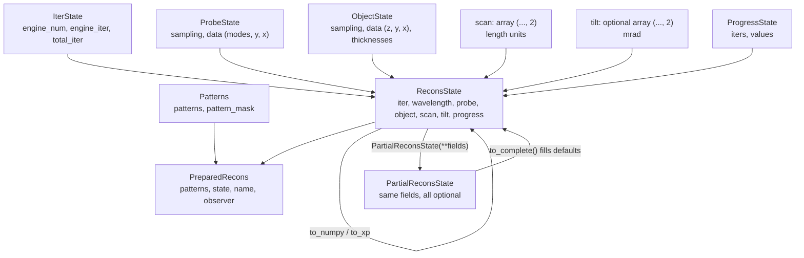

# State and scientific conventions

This page documents the [state](../concepts/glossary.md#state) classes in
`phaser/state.py` and the scientific conventions that apply across all of them: physical
units, axis ordering, the diffraction-pattern origin convention, intensity and count
scaling, and phase convention. Every other architecture page assumes these conventions
rather than restating them.

## State relationships diagram



`ReconsState` requires every field; `PartialReconsState` makes every field optional and
is the type used while restarting from a saved file or merging loader-derived metadata,
before `to_complete()` produces a full `ReconsState`. `PreparedRecons` is the unit an
engine actually receives: the input patterns, the current state, the reconstruction
name, and the observer set. `ProbeState` and `ObjectState` each carry their own `Sampling`
(a coordinate-system object), so probe and object can have independent pixel sizes and
extents until an engine boundary reconciles them (see
[Engine-boundary reshaping](lifecycle.md#engine-boundary-reshaping)).

## State classes

### Patterns

```python
patterns: NDArray[floating]       # raw diffraction patterns
pattern_mask: NDArray[floating]   # which detector pixels contain data
```

`Patterns.patterns` holds the raw diffraction data with **the zero-frequency sample in
the corner of the array** — see [Diffraction-pattern origin](#diffraction-pattern-origin)
below. `pattern_mask` marks which detector pixels are considered valid (for example,
excluding a beamstop or a masked hot-pixel region) and is combined into every noise
model's loss and wave-update calculation.

### ProbeState

```python
sampling: Sampling                    # probe coordinate system
data: NDArray[complexfloating]        # shape (modes, y, x)
```

`data` is the probe wavefunction in real space. The leading axis is the
[mode](../concepts/glossary.md#mode) axis: a single coherent probe has one mode; a
[mixed-state](../concepts/glossary.md#mixed-state) probe (`probe_modes > 1`) has several,
modeling partial spatial coherence as an incoherent sum of orthogonal modes.

### ObjectState

```python
sampling: ObjectSampling              # object coordinate system
data: NDArray[complexfloating]        # shape (z, y, x)
thicknesses: NDArray[floating]        # per-slice thickness, length units
```

`data`'s leading axis is the slice axis along the beam direction. `thicknesses` gives each
slice's physical thickness; a single-slice object has fewer than two thicknesses
(`len(thicknesses) < 2`), a [multislice](../concepts/glossary.md#slice-multislice)
object has one thickness per slice. `ObjectState.zs()` returns each slice's starting
depth, computed as a cumulative sum of `thicknesses`.

Scientifically, the object's amplitude corresponds to absorption, and its phase is
approximately proportional to the projected electrostatic potential the beam passed
through — this is what makes phase the primary reconstructed quantity for weakly
absorbing specimens.

### IterState and ProgressState

`IterState` (`engine_num`, `engine_iter`, `total_iter`, plus optional `n_engine_iters` and
`n_total_iters`) tracks progress through the reconstruction; all three counters are
1-indexed, with `0` meaning "before any iterations of that kind have run." See
[iteration](../concepts/glossary.md#iteration) in the glossary. `ProgressState` records
error measurements taken during a run as parallel `iters`/`values` lists, keyed by name in
`ReconsState.progress` (for example, a `tilt_update_rms` series when tilt is being
refined).

### ReconsState, PartialReconsState, and PreparedRecons

`ReconsState` (`iter`, `wavelength`, `probe`, `object`, `scan`, `tilt`, `progress`)
requires every field. `PartialReconsState` has the same fields, all optional — it is the
type read from an HDF5 restart file or built while merging loader-derived metadata, before
`to_complete()` fills in a full `ReconsState` (raising `ValueError` if `probe`, `object`,
`scan`, or `wavelength` is still missing). `PreparedRecons` (`patterns`, `state`, `name`,
`observer`) is the unit `phaser.execute.execute_engine` actually passes to an engine hook.

## Units and axis ordering

| Quantity | Field | Units | Shape / axis order |
| --- | --- | --- | --- |
| Scan position | `ReconsState.scan` | length (Å, consistent with `wavelength`; see below) | `(..., 2)`, last axis `(y, x)` |
| Tilt angle | `ReconsState.tilt` | mrad | `(..., 2)`, last axis `(y, x)`, one value per scan position |
| Electron wavelength | `ReconsState.wavelength` | Å | scalar |
| Probe defocus | `FocusedProbeProps.defocus` | Å (positive is overfocus) | scalar |
| Probe semiconvergence angle | `FocusedProbeProps.conv_angle` | mrad | scalar |
| Object slice thickness | `ObjectState.thicknesses` | length (Å, consistent with `wavelength`) | `(z,)` |
| Probe/object data | `ProbeState.data`, `ObjectState.data` | dimensionless complex amplitude | `(modes, y, x)`, `(z, y, x)` |

Length units are Å throughout: `Electron(voltage).wavelength` (`phaser/utils/physics.py`)
returns wavelength in Å, and loaders compute the real-space pixel size from wavelength and
detector geometry in the same units (for example, `phaser/hooks/io/empad.py:83`:
`a = wavelength / (diff_step * 1e-3)`, converting a `diff_step` given in mrad to radians
before dividing). `y, x` is the axis order used consistently for scan positions, tilt
angles, and the last two axes of every 2D array (probe, object slice, diffraction
pattern) — never `x, y`.

## Diffraction-pattern origin

!!! warning "Restriction"
    Diffraction patterns are stored **corner-origin**: the zero-frequency (direct-beam)
    sample is in the corner of the array, not centered. `Patterns.patterns`'s docstring
    (`phaser/state.py:20`) states this directly: "Raw diffraction patterns, with
    0-frequency sample in corner." Every built-in loader enforces it by applying
    `numpy.fft.ifftshift(..., axes=(-1, -2))` to the patterns and mask it loads — see
    `phaser/hooks/io/empad.py:74,91`, `phaser/hooks/io/gatan.py:70,92`, and
    `phaser/hooks/io/nion.py:86,110`. The manual loader (`phaser/hooks/io/manual.py:103-105`)
    applies the same shift unless the plan sets `fftshifted: true`, meaning the source file
    is already corner-origin.

Internally, `phaser.utils.num.fft2`/`ifft2` "follow our convention of centering real space
and normalizing intensities" (their docstrings) when their `shift` argument is `True` (the
default) — real-space arrays (probe, object) are centered, while the corresponding
reciprocal-space (diffraction) arrays stay corner-origin to match the stored patterns.

## Intensity and count scaling

Diffraction pattern values are expected to be in physical particle counts (electrons or
photons), not an arbitrary intensity scale: `initialize_reconstruction`
(`phaser/execute.py:367-374`) computes the mean total pattern intensity after
initialization and logs a warning if it is below `5.0`, suggesting the `scale` or
`poisson` `post_load` hooks (`phaser/hooks/__init__.py`) if the data is not already scaled
to counts.

Count scaling matters beyond that warning because it feeds directly into the statistical
assumptions a [noise model](../concepts/glossary.md#noise-model) makes:

- the **Poisson** noise model's loss (`PoissonNoiseModel.calc_loss`,
  `phaser/engines/common/noise_models.py:86-102`) is a Poisson negative log-likelihood
  comparing measured counts to the simulated intensity — correct only if the input
  patterns really are in count units, since Poisson statistics describe discrete
  particle-counting noise specifically;
- the **amplitude** and **anscombe** noise models (`phaser/engines/common/noise_models.py`)
  compare square-root amplitudes with a fixed Gaussian variance term, a less direct
  function of count scale but still calibrated to a particular noise level;
- object and probe **regularizers** (`phaser/hooks/regularization.py`) weight a prior term
  against the noise-model loss; if patterns are scaled incorrectly, the noise-model loss
  magnitude shifts relative to the regularizer's fixed weight, changing the effective
  strength of regularization even though its `weight`/`cost` field did not change.

!!! warning "Restriction"
    The Poisson noise model works only with the **gradient engine**. Its
    `calc_wave_update` raises `NotImplementedError()` unconditionally
    (`phaser/engines/common/noise_models.py:104-112`); only its `calc_loss` is implemented.
    The gradient engine's loss computation calls only `calc_loss`
    (`phaser/engines/gradient/run.py`), so Poisson works there, but conventional solvers
    (ePIE, LSQML) call `calc_wave_update` (`phaser/engines/conventional/solvers.py:255,490`)
    and would raise at runtime if configured with `noise_model: poisson` — even though the
    plan schema accepts `poisson` for both engine types without complaint at validation
    time.

## Phase convention

The object's phase is approximately proportional to the specimen's projected electrostatic
potential along the beam direction (see [ObjectState](#objectstate) above); its amplitude
represents absorption. Beyond this object/potential relationship and the corner-origin
diffraction convention above, this page does not assert a specific propagation phase-sign
convention (for example, the sign of the exponent used in slice-to-slice propagation) —
that was not verified against code for this page and is not claimed here.

## Serialization

A `ReconsState` or `PartialReconsState` is written to, and read from, an HDF5 file via
`write_hdf5`/`read_hdf5` (`phaser/state.py`, implemented in `phaser/utils/io.py`). Written
files carry a `type` marker (`'phaser_state'`) and a `version` marker, checked on read —
see [serialization](../concepts/glossary.md#serialization) in the glossary. `init.state` in
a plan points at such a file to restart a reconstruction; see
[Initialization merge semantics](lifecycle.md#raw-data-loading-and-the-initialization-merge)
for how a restart's state interacts with the plan's `init.*` hooks.

## Maintainer sources

- `phaser/state.py`
- `phaser/execute.py`
- `phaser/utils/num.py`
- `phaser/utils/physics.py`
- `phaser/hooks/io/empad.py`
- `phaser/hooks/io/gatan.py`
- `phaser/hooks/io/nion.py`
- `phaser/hooks/io/manual.py`
- `phaser/hooks/__init__.py`
- `phaser/hooks/regularization.py`
- `phaser/engines/common/noise_models.py`
- `phaser/engines/conventional/solvers.py`
- `phaser/engines/gradient/run.py`
