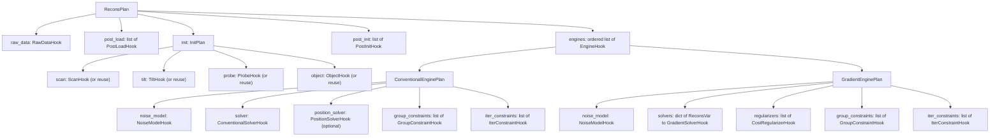

# Cookbook

The cookbook is for scientists preparing data, configuring a reconstruction, inspecting
results, and troubleshooting. You shouldn't need to understand Python inheritance,
registries, protocols, or package imports to use it — those are covered, if you want
them, in the [architecture guide](../architecture/index.md).

## What's here

- **[Choosing a reconstruction engine](engine-selection.md)** — the engine compatibility
  matrix and selection guidance.
- **[Minimal complete reconstructions](reconstructions/index.md)** — self-contained,
  portable, validated plans, one per engine and data source.
- **[Recipes](recipes/index.md)** — goal-oriented guides for a specific change to a
  reconstruction (coarse-to-fine, engine handoffs, adding probe modes, position/tilt
  refinement, restart, regularization, Optuna sweeps).
- **[Parameter reference](parameters/index.md)** — every plan option, organized by the
  decision you're making rather than by YAML nesting.
- **[Performance](performance.md)** — grouping, buffering, and memory tuning.
- **[Troubleshooting](troubleshooting.md)** — symptom-organized failure modes.

## Suggested reading order

1. Start with [Get started](../get-started/index.md) if you have not already.
2. Read [Choosing a reconstruction engine](engine-selection.md) to pick a starting
   engine and confirm it supports your noise model, backend, and refinable variables.
3. Copy the closest [minimal complete reconstruction](reconstructions/index.md) to your
   data and data loader.
4. Use the [parameter reference](parameters/index.md) to adjust individual options, and
   the [recipes](recipes/index.md) to make a specific, goal-oriented change (for
   example, handing off from a conventional engine to gradient descent).
5. If something goes wrong, check [Troubleshooting](troubleshooting.md) by symptom
   before [Performance](performance.md) by tuning goal.

Every cookbook page links to the [architecture](../architecture/index.md) pages
explaining the machinery behind it, for readers who want to go deeper.

## How a plan is put together

A reconstruction is configured by one **plan**: a validated `ReconsPlan`
(`phaser/plan.py`). Most of a plan's fields are themselves **hooks** — configuration
naming a behavior (a loader, an initializer, a noise model, a solver, a regularizer)
either by a short built-in name or an external `"package.module:function"` reference.
The diagram below shows where hook-valued fields appear in a plan; see the
[glossary](../concepts/glossary.md#hook) for what a hook is in general, and
[Choosing a reconstruction engine](engine-selection.md) for how the two engine kinds
differ.

Two details the diagram can't show safely, since they're conditional rather than
structural: a plan's `engines` list runs in order against one shared state, and each
engine transition can reshape that state (see the
[lifecycle diagram](../architecture/lifecycle.md#lifecycle-diagram)); and
`ConventionalEnginePlan` has no `regularizers` field at all — conventional engines accept
group and iteration constraints but not cost regularizers (see
[regularizer](../concepts/glossary.md#regularizer) in the glossary).

## Maintainer sources

- `phaser/plan.py`
